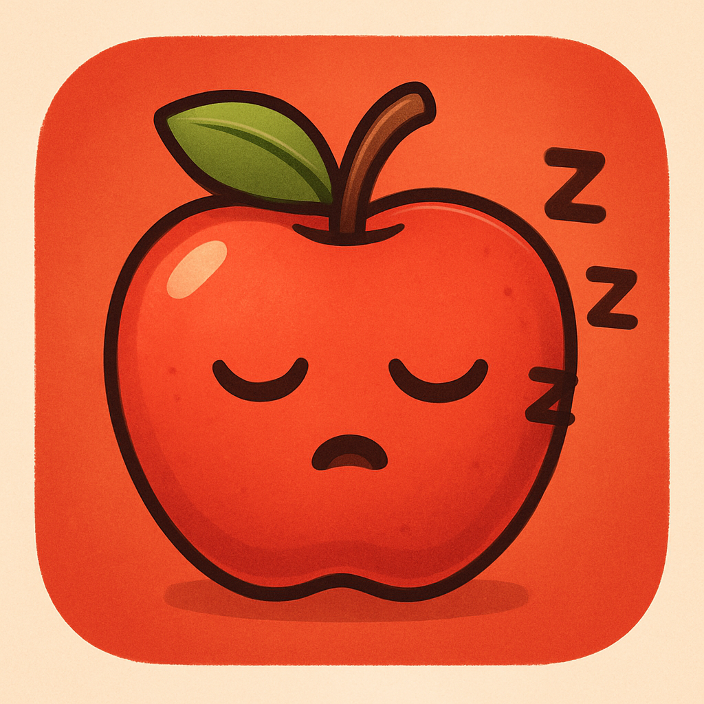

# meet saverage

Small app to explain how apple health is messing with you.

### What is this?
This is a little app that showcases how a multi-trillion company like [Apple Inc](https://apple.com) lies to you about your sleep
average over six months to make you feel better.

### Why is that?
I don't know, could be that someone miscalculated it and nobody spotted it&mdash;but why?

### What is wrong?
For some reason the number of days during the six month average calculation is wrongly computed, missing around 32 days,
making you feel better about your sleep habits.

### Will it ever be fixed?
I hope so, it's not that hard.

### look
